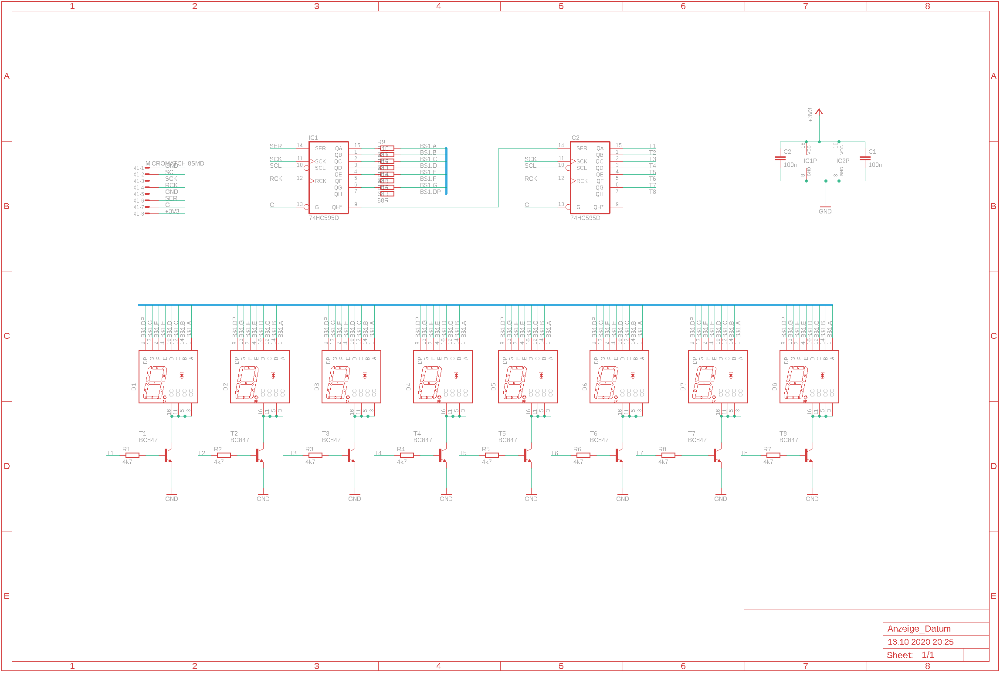
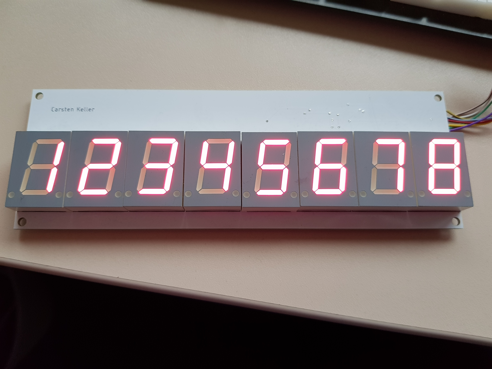

# AlphaNumericDisplayTest
Programm to Test Alphanumeric Displays to Display Fay Of Week

## Pin Connections
RB3 - Enable Date  
RB6 - Programmer  
RB7 - Programmer  
RC6 - TX (9600 Baud, 8N1)  
RC7 - RX (unused at the moment)  
RC5 - SPI-TX  
RC3 - SPI-CLK  

## Display
  
